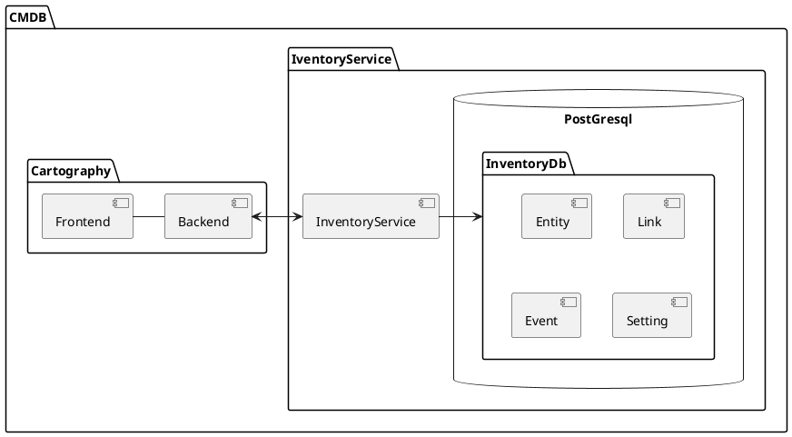

# CMDB

## 2025-07-08

```plantuml
@startuml

package CMDB {
  package IventoryService {
    database "PostGresql" {
      folder "InventoryDb" as db {
        [Entity]
        [Link]
        [Event]
        [Setting]
      }
    }

    [InventoryService] as inventoryservice
    inventoryservice -> db
  }

  package Cartography {
    [Backend] as cartographybackend
    [Frontend] as cartographyfrontend
    cartographyfrontend - cartographybackend
  }
  cartographybackend <-> inventoryservice
}

@enduml
```
