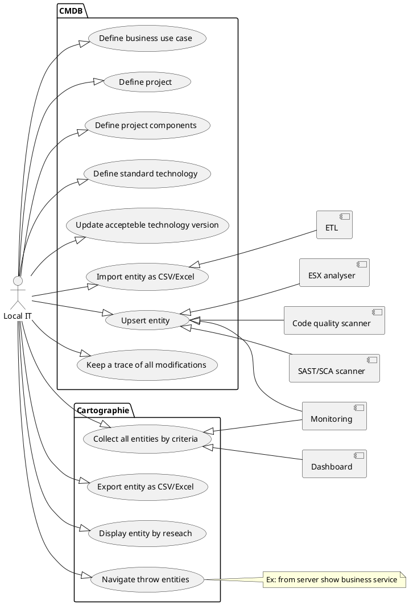
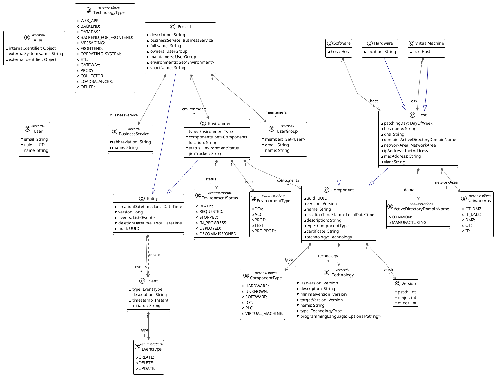

# Cartography core: Business

## Use case diagram

```plantuml
@startuml

left to right direction

actor "Local IT" as p1

package CMDB {
  usecase (Define business use case) as uc1
  usecase (Define project) as uc2
  usecase (Define project components) as uc3
  usecase (Define standard technology) as uc4
  usecase (Update accepteble technology version) as uc5
  usecase (Import entity as CSV/Excel) as uc8
  usecase (Upsert entity) as uc10
  usecase (Keep a trace of all modifications) as uc11
}
p1 --|> uc1
p1 --|> uc2
p1 --|> uc3
p1 --|> uc4
p1 --|> uc5
p1 --|> uc8
p1 --|> uc10
p1 --|> uc11

package Cartographie {
  usecase (Collect all entities by criteria) as uc6
  usecase (Export entity as CSV/Excel) as uc7
  usecase (Display entity by reseach) as uc9
  usecase (Navigate throw entities) as uc12
}
note right of uc12 : Ex: from server show business service
p1 --|> uc6
p1 --|> uc7
p1 --|> uc9
p1 --|> uc12

[ETL] as etl
uc8 <|-- etl
[Monitoring] as mon
uc6 <|-- mon
uc10 <|-- mon
[Dashboard] as dash
uc6 <|-- dash
[ESX analyser] as c1
uc10 <|-- c1
[Code quality scanner] as c2
uc10 <|-- c2
[SAST/SCA scanner] as c3
uc10 <|-- c3
@enduml

```

## Class diagram

```plantuml
@startuml

!theme plain
top to bottom direction
skinparam linetype polyline

enum ActiveDirectoryDomainName << enumeration >> {
  + COMMON:
  + MANUFACTURING:
}
entity Alias << record >> {
  - internalIdentifier: Object
  - externalSystemName: String
  - externalIdentifier: Object
}
entity BusinessService << record >> {
  - abbreviation: String
  - name: String
}
class Component {
  - uuid: UUID
  - version: Version
  - name: String
  - creationTimeStamp: LocalDateTime
  - description: String
  - type: ComponentType
  - certificate: String
  - technology: Technology
}
enum ComponentType << enumeration >> {
  + HARDWARE:
  + UNKNOWN:
  + SOFTWARE:
  + IOT:
  + PLC:
  + VIRTUAL_MACHINE:
}
class Entity {
  - creationDatetime: LocalDateTime
  - version: long
  - events: List<Event>
  - deletionDatetime: LocalDateTime
  - uuid: UUID
}
class Environment {
  - type: EnvironmentType
  - components: Set<Component>
  - location: String
  - status: EnvironmentStatus
  - jiraTracker: String
}
enum EnvironmentStatus << enumeration >> {
  + READY:
  + REQUESTED:
  + STOPPED:
  + IN_PROGRESS:
  + DEPLOYED:
  + DECOMMISSIONED:
}
enum EnvironmentType << enumeration >> {
  + DEV:
  + ACC:
  + PROD:
  + TEST:
  + PRE_PROD:
}
class Event {
  - type: EventType
  - description: String
  - timestamp: Instant
  - initiator: String
}
enum EventType << enumeration >> {
  + CREATE:
  + DELETE:
  + UPDATE:
}
class Hardware {
  - location: String
}
class Host {
  - patchingDay: DayOfWeek
  - hostname: String
  - dns: String
  - domain: ActiveDirectoryDomainName
  - networkArea: NetworkArea
  - ipAddress: InetAddress
  - macAddress: String
  - vlan: String
}
enum NetworkArea << enumeration >> {
  + OT_DMZ:
  + IT_DMZ:
  + DMZ:
  + OT:
  + IT:
}
class Project {
  - description: String
  - businessService: BusinessService
  - fullName: String
  - owners: UserGroup
  - maintainers: UserGroup
  - environments: Set<Environment>
  - shortName: String
}
class Software {
  - host: Host
}
entity Technology << record >> {
  - lastVersion: Version
  - description: String
  - minimalVersion: Version
  - targetVersion: Version
  - name: String
  - type: TechnologyType
  - programmingLanguage: Optional<String>
}
enum TechnologyType << enumeration >> {
  + WEB_APP:
  + BACKEND:
  + DATABASE:
  + BACKEND_FOR_FRONTEND:
  + MESSAGING:
  + FRONTEND:
  + OPERATING_SYSTEM:
  + ETL:
  + GATEWAY:
  + PROXY:
  + COLLECTOR:
  + LOADBALANCER:
  + OTHER:
}
entity User << record >> {
  - email: String
  - uuid: UUID
  - name: String
}
entity UserGroup << record >> {
  - members: Set<User>
  - email: String
  - name: String
}
class Version {
  ~ patch: int
  ~ major: int
  ~ minor: int
}
class VirtualMachine {
  - esx: Host
}

Component                 "1" *-[#595959,plain]-> "type\n1" ComponentType
Component                 "1" *-[#595959,plain]-> "technology\n1" Technology
Component                 "1" *-[#595959,plain]-> "version\n1" Version
Entity                    "1" *-[#595959,plain]-> "events\n*" Event
Entity                     -[#595959,dashed]->  Event                     : "«create»"
Environment               "1" *-[#595959,plain]-> "components\n*" Component
Environment                -[#000082,plain]-^  Entity
Environment               "1" *-[#595959,plain]-> "status\n1" EnvironmentStatus
Environment               "1" *-[#595959,plain]-> "type\n1" EnvironmentType
Event                     "1" *-[#595959,plain]-> "type\n1" EventType
Hardware                   -[#000082,plain]-^  Host
Host                      "1" *-[#595959,plain]-> "domain\n1" ActiveDirectoryDomainName
Host                       -[#000082,plain]-^  Component
Host                      "1" *-[#595959,plain]-> "networkArea\n1" NetworkArea
Project                   "1" *-[#595959,plain]-> "businessService\n1" BusinessService
Project                    -[#000082,plain]-^  Entity
Project                   "1" *-[#595959,plain]-> "environments\n*" Environment
Project                   "1" *-[#595959,plain]-> "maintainers\n1" UserGroup
Software                   -[#000082,plain]-^  Component
Software                  "1" *-[#595959,plain]-> "host\n1" Host
VirtualMachine            "1" *-[#595959,plain]-> "esx\n1" Host
VirtualMachine             -[#000082,plain]-^  Host

@enduml
```
